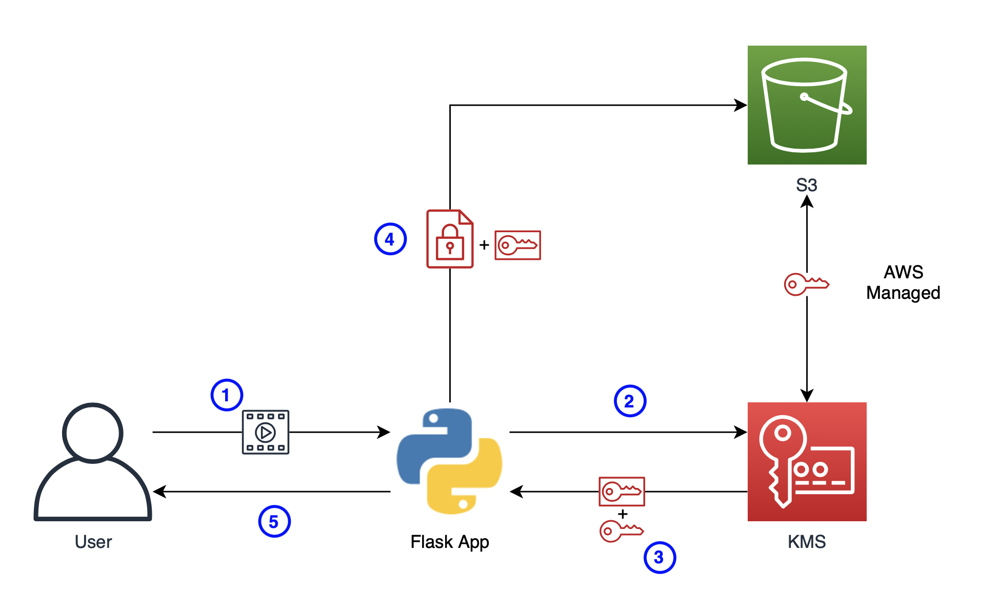
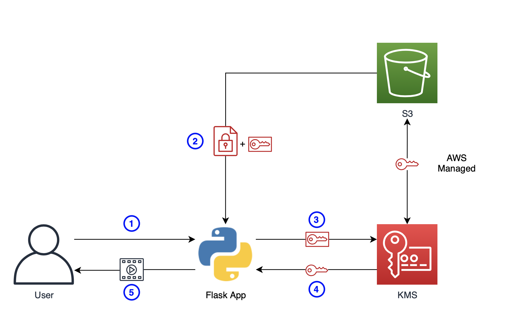

# Sample KMS APP

AWS KMS 서비스를 사용해보기 위해 제작한 파일을 업로드, 다운로드하는 간단한 웹서버입니다.

## 업로드 과정

업로드 과정에서 실제 파일이 저장되기까지 두 번의 암호화가 함께합니다. 첫 번째는 S3 자체의 암호화(SSE-KMS, AWS managed key), 그리고 두 번째는 앱에서 자체적으로 진행하는 CMK 암호화입니다.

1. 사용자가 웹 서버에 파일을 업로드합니다.
2. KMS에 암호화 키를 AES 256 암호화 키라는 정보를 함께 요청합니다.
3. KMS에서 Encrypted Key와 Plain Key를 받습니다.
4. Plain Key로 암호화한 파일과 Encrypted Key를 함께 S3에 저장합니다.
5. 사용자에게 파일 이름을 반환합니다.

## 다운로드 과정

1. 사용자가 다운로드 요청을 보냅니다.
2. S3에서 Encrypted Key와 암호화된 파일을 내려받습니다.
3. Encrypted Key를 복호화하기 위해 KMS에 요청을 보냅니다.
4. KMS에서 복호화한 Plain Key를 받습니다.
5. Plain Key로 암호화된 파일을 복호화해 사용자에게 전달합니다.

## LICENSE

[Beerware](https://en.wikipedia.org/wiki/Beerware)
